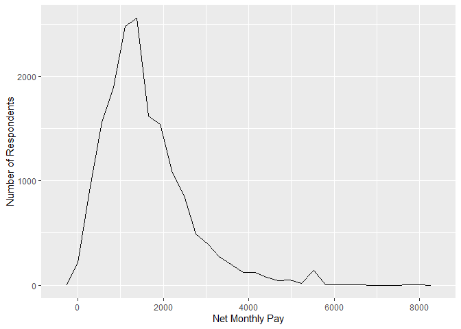
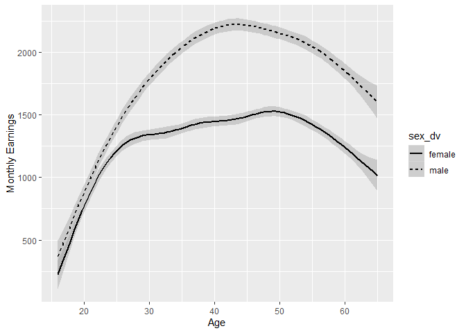
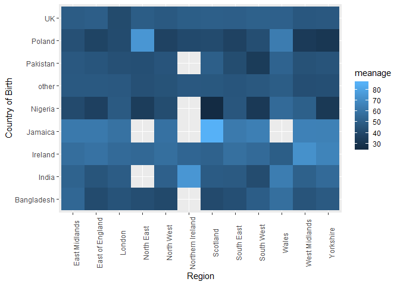
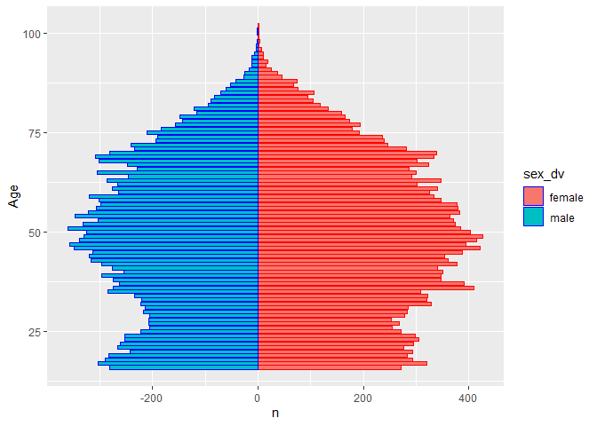

Statistical assignment 4
================
\[Daniel Orchard\]
\[26 Feb 2020\]

In this assignment you will need to reproduce 5 ggplot graphs. I supply
graphs as images; you need to write the ggplot2 code to reproduce them
and knit and submit a Markdown document with the reproduced graphs (as
well as your .Rmd file).

First we will need to open and recode the data. I supply the code for
this; you only need to change the file paths.

    ```r
    library(tidyverse)
    Data8 <- read_tsv("C:/Users/dan19/Documents/MY DOCUMENTS/Year 2 Term 2 Modules/Data III/Understanding Society Data/UKDA-6614-tab/tab/ukhls_w8/h_indresp.tab")
    Data8 <- Data8 %>%
        select(pidp, h_age_dv, h_payn_dv, h_gor_dv)
    Stable <- read_tsv("C:/Users/dan19/Documents/MY DOCUMENTS/Year 2 Term 2 Modules/Data III/datan3_2020/data/UKDA-6614-tab/tab/ukhls_wx/xwavedat.tab")
    Stable <- Stable %>%
        select(pidp, sex_dv, ukborn, plbornc)
    Data <- Data8 %>% left_join(Stable, "pidp")
    rm(Data8, Stable)
    Data <- Data %>%
        mutate(sex_dv = ifelse(sex_dv == 1, "male",
                           ifelse(sex_dv == 2, "female", NA))) %>%
        mutate(h_payn_dv = ifelse(h_payn_dv < 0, NA, h_payn_dv)) %>%
        mutate(h_gor_dv = recode(h_gor_dv,
                         `-9` = NA_character_,
                         `1` = "North East",
                         `2` = "North West",
                         `3` = "Yorkshire",
                         `4` = "East Midlands",
                         `5` = "West Midlands",
                         `6` = "East of England",
                         `7` = "London",
                         `8` = "South East",
                         `9` = "South West",
                         `10` = "Wales",
                         `11` = "Scotland",
                         `12` = "Northern Ireland")) %>%
        mutate(placeBorn = case_when(
                ukborn  == -9 ~ NA_character_,
                ukborn < 5 ~ "UK",
                plbornc == 5 ~ "Ireland",
                plbornc == 18 ~ "India",
                plbornc == 19 ~ "Pakistan",
                plbornc == 20 ~ "Bangladesh",
                plbornc == 10 ~ "Poland",
                plbornc == 27 ~ "Jamaica",
                plbornc == 24 ~ "Nigeria",
                TRUE ~ "other")
        )
    ```

Reproduce the following graphs as close as you can. For each graph,
write two sentences (not more\!) describing its main message.  
\# remember 2 sentences per graph describing its main message

1.  Univariate distribution (20 points). 
    
    ``` r
    ggplot(Data, mapping = aes(x = h_payn_dv)) +
    geom_freqpoly() +
    xlab("Net Monthly Pay") +
    ylab("Number of Respondents")
    ```
    
    <!-- -->

2.  Line chart (20 points). The lines show the non-parametric
    association between age and monthly earnings for men and women.
    
    ``` r
    ggplot(Data, mapping = aes(x = h_age_dv, y = h_payn_dv,linetype = sex_dv)) +
    geom_smooth(color = "black") +
    xlab("Age") +
    ylab("Monthly Earnings") +
    xlim(16,65) 
    ```
    
    <!-- -->

This chart shows that monthly earnings rise with age, peaking at about
45 before declining. It also shows that men on average earn more than
women at every age point, but particluary from ages 25 onwards, where
the gap starts to widen.

# 3\. Faceted bar chart (20 points).

``` r
bysex <- Data %>%
  group_by(sex_dv, placeBorn) %>%
  summarise(
    medianwage = median(h_payn_dv, na.rm = TRUE)) %>% 
    filter(!is.na(sex_dv)) %>%
    filter(!is.na(placeBorn))
    
 bysex %>%   
    ggplot(aes(x = sex_dv, y = medianwage)) +
  geom_bar(stat = "identity") +
  facet_wrap(~ placeBorn, ncol = 3) +
    ylim(0,2000) +
    xlab("Sex") +
    ylab("Median Monthly Net Pay")
```

<!-- -->

These charts show that regardless of place of birth that men on average
have a higher median monthly net pay. The largest differnece in pay
parity appears to be for UK born whilst the lowest is with Bangledeshi
families.

# 4\. Heat map (20 points).

``` r
byregion <- Data %>%
  group_by(h_gor_dv, placeBorn) %>%
  summarise(
    meanage = mean(h_age_dv, na.rm = TRUE)) %>% 
    filter(!is.na(h_gor_dv)) %>%
    filter(!is.na(placeBorn)) 
 
 byregion %>%  ggplot( aes(x = h_gor_dv, y = placeBorn, fill = meanage)) +
    geom_tile() +
    xlab("Region")+
    ylab("Country of Birth") +
    theme(axis.text.x = element_text(angle = 90))
```

<!-- -->

This heat map is designed to show the mean age of residents of each
region of the UK depending on their Country of birth. The chart shows
that the average age seems to be around 60-70 but there are some much
lower mean ages such as for Nigerian born people in Scotland, however
this may be due to a low sample there. There are also a few NAs,
particulary in Northern Ireland.

# 5\. Population pyramid (20 points).

``` r
 #group by age and then by sex
    # then do a count of each age group by sex. then should be about to do it
    
population <- Data %>%  group_by(sex_dv,h_age_dv) %>% 
    count(h_age_dv, sex_dv)   
    
population$n <- ifelse(population$sex_dv == "male", -1*population$n, population$n)
    
 ggplot(population, aes(x = h_age_dv, y = n, fill = sex_dv)) + 
  geom_bar(data = subset(population, sex_dv == "female"), stat = "identity",      colour = "red") +
  geom_bar(data = subset(population, sex_dv == "male"), stat = "identity", colour = "blue") + 
  coord_flip() +
  xlab("Age")
```

<!-- -->

This population pyramid shows that the number of people in age group
starts quite high at 0-25, decreases a bit (possibly due to
emmigration), then reexpands for 30-65 before starting to shrink over
75, presumably as people start to die. It also shows that for most age
groups there are more women than men, especially in old age.
